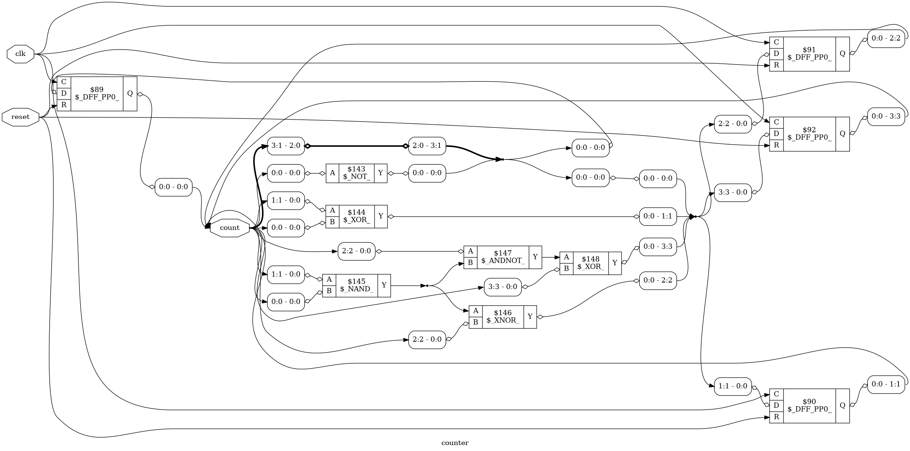

# Software-Based ASIC Design Using Verilog & Yosys

## Overview
This project demonstrates a complete software-based ASIC design flow, from RTL design to gate-level visualization.

## Tools Used
- Verilog HDL
- Yosys
- ABC
- Graphviz
- Ubuntu (WSL)
- Windows

## Design Flow
Verilog → RTL Synthesis → Logic Optimization → Gate-Level Netlist → Circuit Diagram

## Output

## Files Included
- counter.v – Verilog source code
- counter_netlist.v – Gate-level netlist
- counter_design.png – Gate-level circuit diagram
- counter_design.dot – Graphviz representation
- Internship Project.pdf – Complete documentation
